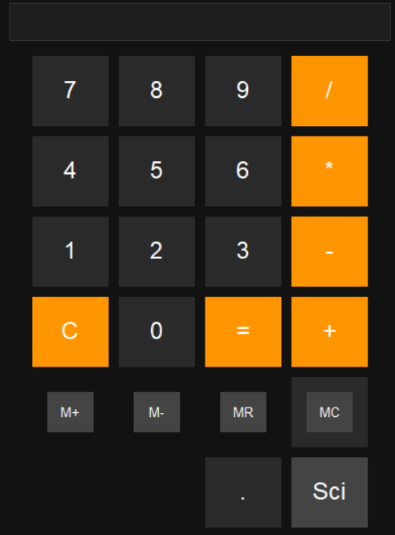
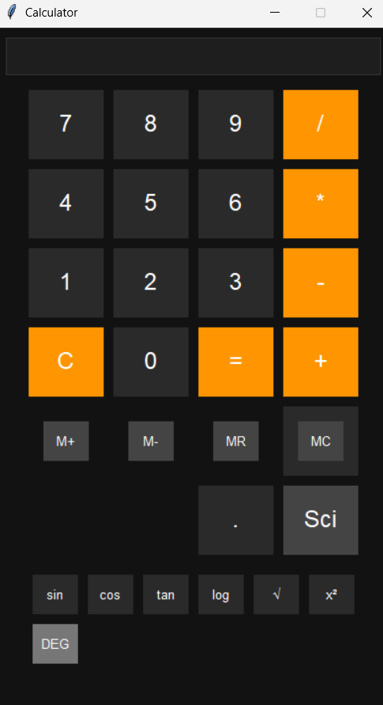

# 🧮 Python Dark-Mode Scientific Calculator

A modern desktop calculator application built with **Python and Tkinter**, designed with safety, clarity, and mathematical correctness in mind.

This project goes beyond a basic calculator by avoiding `eval()`, implementing a custom precedence-safe expression evaluator, and demonstrating DSA concepts in mathematical operations.

---

## ✨ Features

### 🔢 Core Arithmetic

- **Operations:** Addition (+), Subtraction (-), Multiplication (\*), and Division (/) with division-by-zero protection.
- **Precision:** Full decimal number support.
- **UI Safety:** Read-only display prevents invalid manual keyboard input corruption.

### 🧠 Memory Operations

- **M+ / M-:** Add or subtract the displayed value to/from internal memory.
- **MR:** Recall memory value to the display.
- **MC:** Clear memory (standard calculator behavior).

### 📐 Scientific Functions

- **Trigonometry:** `sin`, `cos`, `tan`.
- **Powers:** $x^2$ (square) and $\sqrt{x}$ (square root with precision control).
- **Toggle:** DEG / RAD mode toggle for trigonometric calculations.

### 🎨 User Interface

- **Dark Mode:** Sleek UI designed for reduced eye strain.
- **Responsive:** Grid-based layout with a toggleable scientific mode.
- **Keyboard Support:** Mapping for numbers, operators, Enter, Backspace, and Escape.

---

## 🔐 Engineering Choice: Why `eval()` is NOT used

Python’s `eval()` can execute arbitrary code, making it a security risk. To demonstrate production-style design, this project uses a custom expression evaluator that:

1.  **Only processes** valid numeric tokens and approved operators.
2.  **Prevents execution** of unintended Python commands.
3.  **Provides control** over error handling and mathematical precedence.

### 🧮 How Operator Precedence Works

The evaluator follows standard math rules (Multiplication/Division before Addition/Subtraction) using a **two-pass evaluation strategy**:

1.  **Tokenization:** Converts input string into a list (e.g., `"3*5-5"` → `['3', '*', '5', '-', '5']`).
2.  **First Pass:** Processes all `*` and `/` operations from left to right.
3.  **Second Pass:** Processes all `+` and `-` operations on the remaining tokens.

---

## 📊 Data Structures & Algorithms (DSA)

### Square Root ($\sqrt{x}$) Implementation

Instead of relying solely on `math.sqrt()`, this project demonstrates algorithmic thinking via:

- **Binary Search:** Finding the integer part of the square root in $O(\log n)$ time.
- **Incremental Refinement:** Improving decimal precision digit-by-digit.

### DEG vs RAD Logic

Trigonometric functions operate in radians internally. This calculator uses a state-based toggle to decide whether to convert user input using `math.radians()` before processing, ensuring consistent behavior across all functions.

---

## ⚠️ Known Limitations (Intentional)

To keep the evaluator logic clean and focused on binary operations, the following are intentionally out of scope:

- **Unary Operators:** e.g., `-3 + 5` (input requires `0 - 3 + 5`).
- **Parentheses:** e.g., `(2+3)*4`.

---

## 🚀 How to Run

1. **Clone the repository**
   ```bash
   git clone [https://github.com/SankalpHaritash21/Calculator.git](Chttps://github.com/SankalpHaritash21/Calculator.git)
   cd python-dark-calculator
   ```

<table border="0">
  <tr>
    <td>
      <p align="center"><b>Basic Mode</b></p>
      
    </td>
    <td>
      <p align="center"><b>Scientific Mode</b></p>
      
    </td>
  </tr>
</table>
